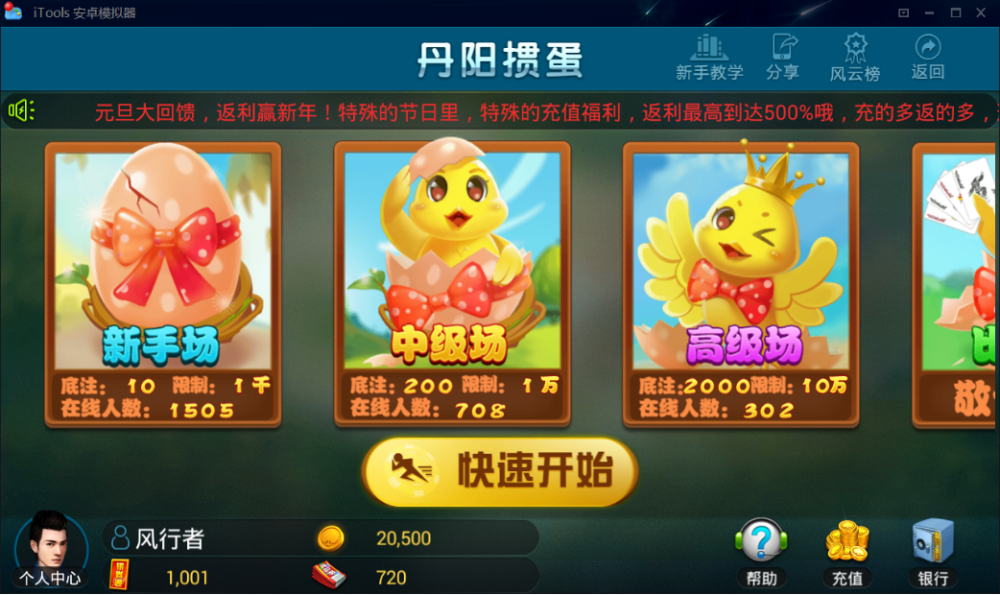
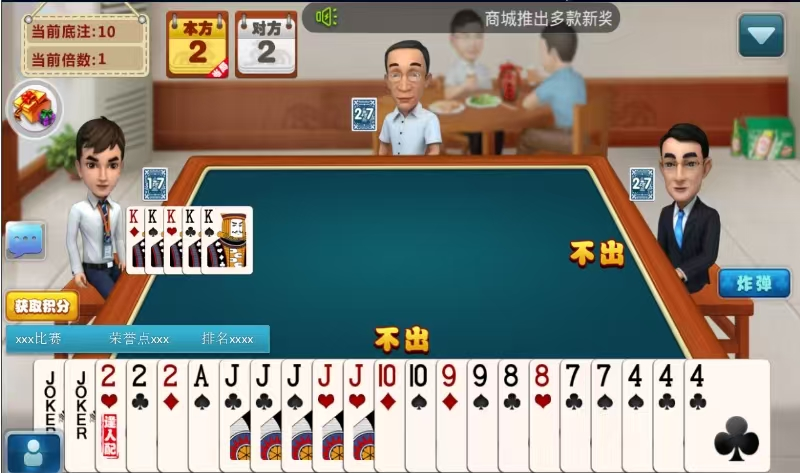
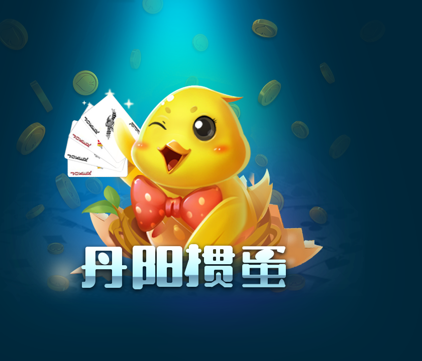
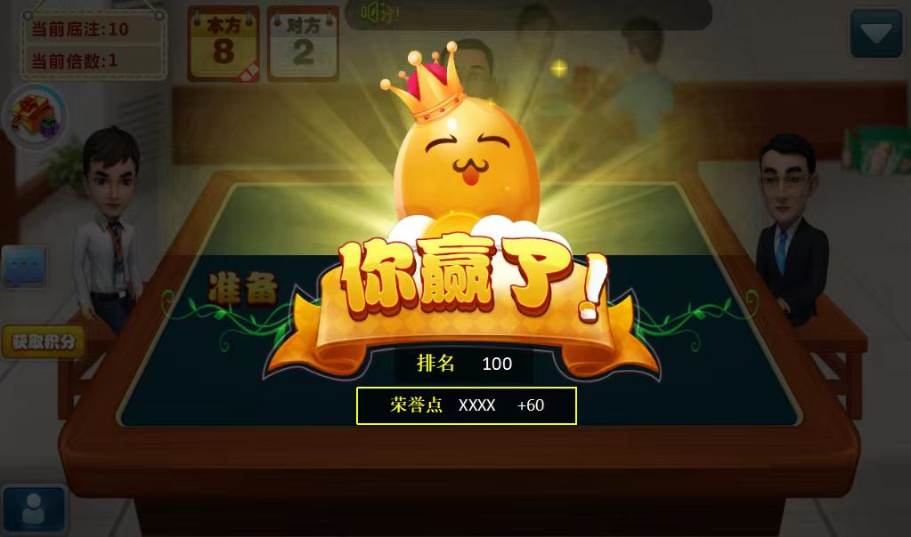

[简体中文](README.md) | [繁體中文](README.zh-TW.md) | [English](README.en.md)

# Guandan Game Source Code: C++ / Cocos2d-x Client Modules

This repository presents verifiable client-side modules and product material for **Guandan game source code**, the Chinese four-player partnership card game also known as Guan Dan. The public files cover application lifecycle, reconnect UI, player/account state, avatar items, exchange data, visual effects and message structures. Authentic screenshots show the lobby, four-player table and result flow.

> Scope note: the public repository is a partial client code collection, not a proven turnkey server, complete rules engine or administration suite. External engine, UI, networking, server and asset dependencies are required.

## Product and gameplay

Four players form two fixed partnerships and play with two decks. Players take turns leading or following combinations, while partners cooperate to finish early and advance their team level. Common combinations include singles, pairs, triples, full houses, straights, consecutive pairs, plates and bombs. Level-card and wild-card details must follow the selected tournament rules.

Typical journey: **lobby → room selection → seat/match → deal → turn-based play → result → level progression**.

## Authentic product screenshots

| Lobby and table | Brand and result |
|---|---|
|  |  |
|  |  |

## Verifiable technical modules

- C++ and Objective-C++ client built around Cocos2d-x-style APIs.
- App launch, scene setup, background/foreground lifecycle and socket shutdown.
- Reconnection prompts and game-room reconnect parameters.
- Account switching, avatar selection/purchase and client data models.
- Shake, ripple and UI effects plus Base64/MD5 helpers.
- Exchange data and client/server message structures.

Complete the missing dependencies and test rules, reconnects, settlement, asset licensing, security and local compliance before deployment.

## Pages

- [English](https://masterai-top.github.io/Egg-Throwing-Arcade-Game-System/en/)
- [Simplified Chinese](https://masterai-top.github.io/Egg-Throwing-Arcade-Game-System/zh-cn/)
- [Traditional Chinese](https://masterai-top.github.io/Egg-Throwing-Arcade-Game-System/zh-tw/)

