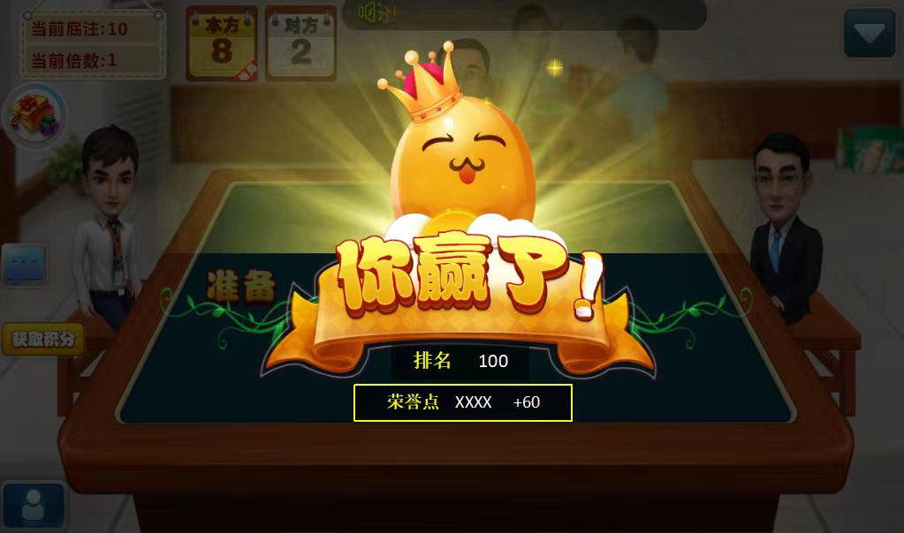
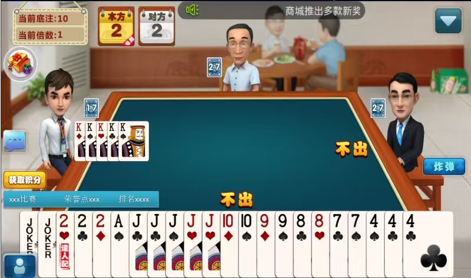

# 摜蛋遊戲源碼 | Egg Throwing Arcade Game System

[簡體中文](README.md) | [English](README.en.md) | [繁體中文](README.zh-TW.md)

Egg Throwing Arcade Game System 是一套面向商業化評估與二次開發的摜蛋遊戲源碼與營運策劃資料項目，覆蓋摜蛋核心規則、組隊對戰、升級機制、團團轉玩法、比賽系統、營運方案、市場調研、產品策劃設計與 C++ 遊戲服務端實現方向。

## 核心定位

- 摜蛋遊戲源碼 / Guandan game source code
- Throwing Eggs card game source code
- C++ 棋牌遊戲服務器與規則引擎
- 團團轉玩法、比賽系統、房間系統與營運活動
- 營運多年項目沉澱的策劃、市場調研與產品設計資料
- 適合商業評估、私有化部署與二次開發

## 核心功能

- 摜蛋規則：升級、進貢、還貢、抗貢、同伴配合、炸彈、順子、三帶二等
- 對戰系統：好友房、金幣房、比賽房、私人局、團隊對戰與戰績統計
- 比賽系統：定時賽、淘汰賽、積分賽、排行榜、獎勵配置與報名流程
- 團團轉玩法：多桌輪轉、分組匹配、賽事節奏與營運活動設計
- 營運資料：市場調研、營運方案、活動策劃、留存策略與商業化設計
- 技術方向：C++ 規則引擎、房間服務、結算邏輯、後台配置與數據庫結構

## 項目結構建議

```text
client/                 # 客戶端源碼或演示工程
server/                 # C++ 遊戲服務、房間服務、規則與結算邏輯
admin/                  # 營運後台、活動配置、比賽配置與數據統計
database/               # 數據庫結構與遷移說明
planning/               # 市場調研、營運方案、產品策劃與活動文檔
config.example/         # 脫敏配置示例
docs/                   # GitHub Pages 產品與技術文檔
scripts/                # 構建、部署與維護腳本
tests/                  # 規則、結算、接口與賽事流程測試
.github/workflows/      # CI 與 GitHub Pages 工作流
```

## 適用場景

- 摜蛋遊戲、棋牌遊戲、地方特色紙牌遊戲源碼評估
- 摜蛋比賽系統、好友房、金幣房、團團轉與營運活動開發
- C++ 棋牌遊戲服務端、規則引擎與後台管理系統二次開發
- 面向國內棋牌、休閒競技與地方牌類市場的產品驗證
- 遊戲公司、棋牌平台與源碼採購方的技術與營運資料參考

## 公開倉庫安全建議

公開倉庫適合展示產品結構、部分源碼、截圖、市場調研摘要與技術文檔。不要公開真實用戶數據、支付密鑰、後台帳號、生產數據庫、私有營運數據、風控參數、真實訂單或未授權素材。

## 文檔

- [項目主頁](docs/index.html)
- [功能介紹](docs/features.html)
- [架構說明](docs/architecture.html)
- [部署指南](docs/deployment.html)
- [合規使用](docs/responsible-use.html)
### 掼蛋游戏中



### 掼蛋游戏玩法界面



### 掼蛋街机活动与奖励


### 掼蛋大厅


## 聯繫方式

Telegram：`@xuzongbin001`  
Email：`masterai918@gmail.com`

## License

僅限技術評估、商務溝通與授權合作，具體以倉庫 License 文件為準。
